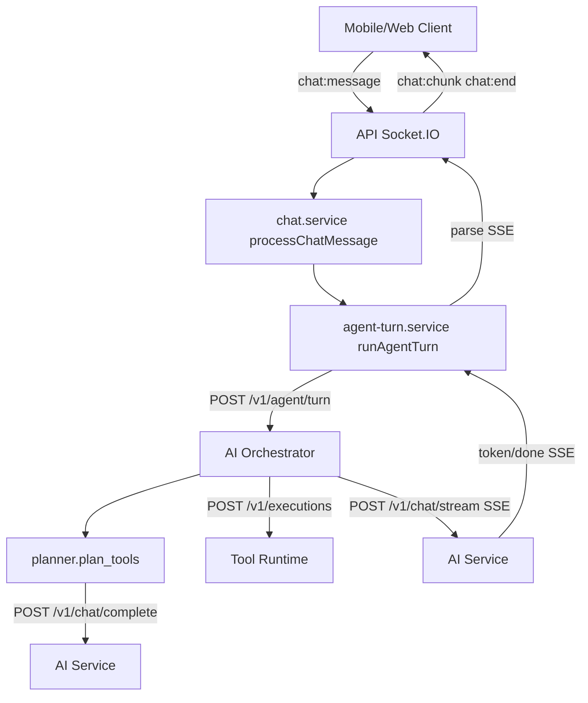
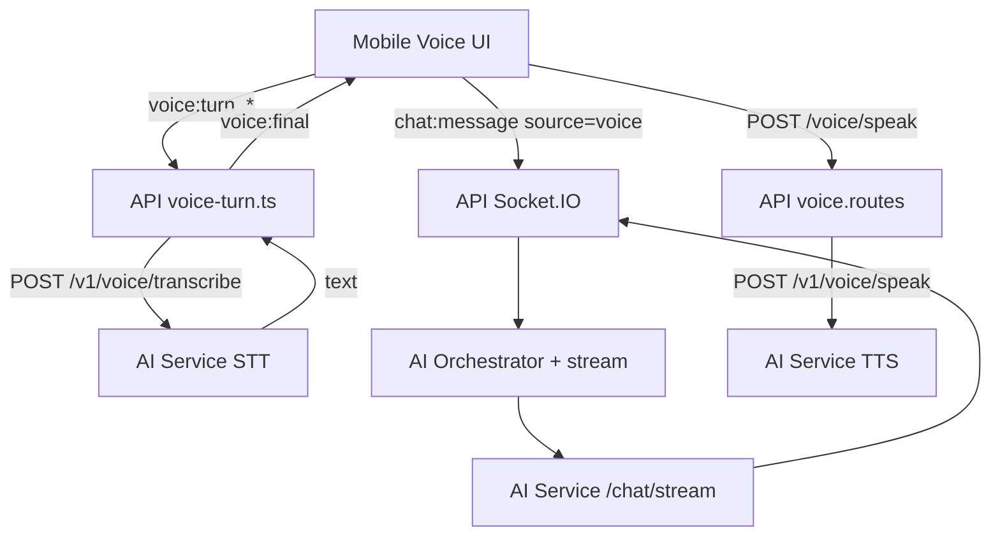

# Core AI — Architecture & Implementation Context

Single reference for how AI work is structured and implemented in this monorepo: chat streaming, tool orchestration, voice (STT/TTS), RAG/memory, and provider routing.

**Rule:** Mobile and web clients never call OpenAI/Gemini/Pollinations directly. All provider traffic goes through the API gateway → orchestration layers → provider implementations.

---

## Table of contents

1. [High-level architecture](#high-level-architecture)
2. [Runtime services & ports](#runtime-services--ports)
3. [Monorepo layout](#monorepo-layout)
4. [Chat streaming (text)](#chat-streaming-text)
5. [Tool planning & execution](#tool-planning--execution)
6. [Action confirmation](#action-confirmation)
7. [Voice assistant (STT → LLM → TTS)](#voice-assistant-stt--llm--tts)
8. [RAG & memory](#rag--memory)
9. [Model & provider routing](#model--provider-routing)
10. [Socket.IO events](#socketio-events)
11. [HTTP API surface (AI-related)](#http-api-surface-ai-related)
12. [Shared packages](#shared-packages)
13. [Client layer](#client-layer)
14. [Observability & infra](#observability--infra)
15. [Environment variables](#environment-variables)
16. [File map (where to look)](#file-map-where-to-look)
17. [Known gaps & inconsistencies](#known-gaps--inconsistencies)

---

## High-level architecture

```
┌─────────────────┐     ┌──────────────────────────────────────────────────────────┐
│  Mobile (Expo)  │     │                    API Gateway (Fastify)                  │
│  Web (Next.js)  │────▶│  REST + Better Auth + Socket.IO + rate limits             │
└────────┬────────┘     │  PostgreSQL (sessions/messages)  Redis (events)           │
         │              └───────┬──────────────────────┬─────────────────┬──────────┘
         │                      │                      │                 │
         │              ┌───────▼────────┐    ┌────────▼────────┐ ┌──────▼───────┐
         │              │ AI Orchestrator │    │  Tool Runtime   │ │ Ingestion    │
         │              │ (FastAPI :3013) │    │  (Fastify :3011)│ │ Engine       │
         │              └───────┬────────┘    └────────┬────────┘ └──────────────┘
         │                      │                      │
         │              ┌───────▼────────┐             │ integrations (WhatsApp, etc.)
         └──────────────│  AI Service     │◀────────────┘
                        │  (FastAPI :8000)│
                        │  RAG + LiteLLM  │
                        └───────┬────────┘
                                │
                    ┌───────────┼───────────┐
                    ▼           ▼           ▼
              Qdrant      OpenAI/Gemini   Pollinations
              (vectors)   Anthropic       (Tier-3 fallback)
```

### Chat turn (mermaid)



### Voice turn (mermaid)



---

## Runtime services & ports

| Service | Default port | Role |
|---------|--------------|------|
| **Gateway** (`services/gateway`, shim `services/api`) | 3000 | Auth, REST, Socket.IO, proxies to AI/tool services |
| **Skill Runtime** | 3014 | Capabilities, SKILL.md catalog, execute → tool-runtime |
| **AI Service** | 8000 | FastAPI: chat stream/complete, RAG, STT/TTS, image, agents stub |
| **AI Orchestrator** | 3013 | FastAPI: tool planning + turn orchestration, streams from AI service |
| **Tool Runtime** | 3011 | Fastify: tool execution, permissions, connector dispatch |
| **Ingestion Engine** | 3012 | Document ingestion (referenced in config) |
| **Web dashboard** | 3001 | Next.js (admin-style; not full chat UI yet) |
| **PostgreSQL** | 5432 | Users, chat sessions, messages, tool invocations, notes |
| **Redis** | 6379 | Domain events pub/sub |
| **Qdrant** | 6333 | Vector store for RAG |

Health: `GET /health` and `GET /health/ready` on API (`:3000`) and AI service (`:8000`).

Dev orchestration: Tilt + Docker Compose (`pnpm tilt:up`). See root [README.md](../README.md).

---

## Monorepo layout

```
apps/
  mobile/                 Expo React Native — primary AI/voice client
  web/                    Next.js dashboard (auth + automations/memory view)

services/
  api/                    Fastify API gateway + Socket.IO
  ai/                     FastAPI — models, RAG, streaming, voice media
  ai-orchestrator/        FastAPI — agent turns, tool planning/execution
  tool-runtime/           Fastify — tool executor
  ingestion-engine/       Ingestion pipeline

packages/
  config/                 Shared env (AI_SERVICE_URL, models, keys)
  types/                  Shared TS types + Socket.IO event payloads
  sdk/                    AssistantClient for mobile/web
  database/               Prisma + PostgreSQL
  auth/                   Better Auth
  tool-schema/            Tool registry + Zod validation + OpenAI schemas
  permissions/            Tool permission + confirmation policies
  integrations/           Connector implementations (WhatsApp, Google, …)
  memory/                 API-side memory helpers
  events/                 Redis domain events
  telemetry/              OpenTelemetry bootstrap
  workflows/              Workflow definitions

infra/
  docker/                 Layered compose (core, monitoring, Langfuse, dev)
  tilt/                   Tilt modules
  monitoring/             Prometheus, Grafana, Loki, OTel collector
```

---

## Chat streaming (text)

### End-to-end flow

1. **Client** connects Socket.IO via `AssistantClient.connectSocket(token)` (`packages/sdk`).
2. Client emits **`chat:message`** with `{ text, chatSessionId?, confirmed?, source? }` (RAG retrieval is on by default server-side).
3. **API** (`services/gateway/src/socket/index.ts`):
   - Authenticates handshake (Better Auth session).
   - Rate-limits (`enforceSocketRateLimits`).
   - Handles inline confirm replies (`yes`/`no`) if pending.
   - Calls **`processChatMessage`** (`services/gateway/src/services/chat.service.ts`).
4. **Chat service**:
   - Creates/resolves `chatSession` in PostgreSQL.
   - Saves user `message`.
   - Loads last 10 messages.
   - Calls **`runAgentTurn`** (`services/gateway/src/services/agent-turn.service.ts`) with RAG enabled by default (`resolveRagEnabled`; ops can set `RAG_ENABLED=false`).
5. **Agent turn** posts to **Cognitive Runtime** `POST /v1/agent/turn` (not directly to AI service).
6. **Cognitive Runtime** (`services/cognitive-runtime/main.py`):
   - Fetches RAG once per turn (when enabled) into `retrieved_context` (merged with file attachment context).
   - **Conversational fast path** (`hello`, short Q&A): skips manifest/tools/planner; streams directly with `task=fast_chat`.
   - **Full path**: `build_context` (reuses cached RAG block for planner) → `plan_tools` → tool execution.
   - RAG context is passed to AI service as `retrieved_context` on `/v1/chat/stream` (single injection point; `rag_enabled: false` on that call avoids duplicate search).
   - If confirmation required → JSON `{ requiresConfirmation, tools }`.
   - Else **streams** AI service `POST /v1/chat/stream` (SSE passthrough).
7. **API** parses SSE: `token` → **`chat:chunk`**; `done` → `modelUsed` / `modelLabel`; saves assistant message; **`chat:end`**.
8. **Memory ingest** (async): `ingestConversationMemory` after turn completes.

### AI service chat stream (`services/ai-runtime/api/chat.py`)

- **`task`**: `auto` (default) or explicit (`fast_chat`, `reasoning`, `coding`, …). `task_router.classify_task` picks a chain from `config/ai-models.yaml`.
- If `retrieved_context` is set (from cognitive-runtime RAG), it is injected into the user message (no duplicate RAG in stream).
- Else if `rag_enabled`: async `_retrieve_context` → `RAGService.search_context`.
- **`stream_completion_sse`** (`services/ai-runtime/models/streaming/completion.py`):
  - `resolve_chain(task)` via `model_resolver.py`.
  - Tries each model via LiteLLM streaming; emits SSE `token` / `done` (includes `model` id).
  - Simulation fallback when no keys.

### Important detail

**Primary chat path goes through AI Orchestrator**, not `fetchAi('/v1/chat/stream')` from the API. Direct AI service chat endpoints exist for orchestrator/planning and can be used elsewhere; the socket path is orchestrator-first for tool-aware turns.

---

## Tool planning & execution

### Planner (`services/cognitive-runtime/orchestration/planner.py`)

1. `GET tool-runtime /v1/tools/available?userId=…` → OpenAI-style tool list + active connections.
2. Prompts AI service **`/v1/chat/complete`** with system instruction: return JSON `{ tools: [{ tool, args }] }`.
3. Filters to tools the user actually has.
4. Fallback heuristics: WhatsApp send/search, notes create/search.

### Executor (`services/cognitive-runtime/orchestration/executor.py`)

- For each planned tool: `POST tool-runtime /v1/executions` with `userId`, `tool`, `args`, `source`, `confirmed`, `connectionId`.
- HTTP **428** → `requiresConfirmation` in result.
- Polls execution status until `completed` | `failed` | `cancelled`.
- WhatsApp: resolves JID from prior `whatsapp.search_chats` result.

### Tool runtime (`services/tool-runtime`)

| Step | Module |
|------|--------|
| Validate tool + args | `packages/tool-schema` — `getToolDefinition`, `validateToolArgs` |
| Permission / confirmation | `packages/permissions` — `checkToolPermission` |
| Resolve connector + credentials | `packages/integrations`, Prisma `userConnection`, `encryption.ts` |
| Execute | `executor.ts` → connector or `notes-executor.ts` |
| Events | Redis via `packages/events` → API `event-fanout.ts` → Socket `tool:*` |

API exposes tools at `/tools/execute`, `/tools/available` (`services/gateway/src/routes/tool.routes.ts`) — proxies to tool-runtime.

---

## Action confirmation

Two UX paths from API (`chat.service.ts` + socket):

| Type | When | Client behavior |
|------|------|-----------------|
| **Inline confirm** | Tool in `usesInlineConfirm` set (e.g. notes) | Assistant asks in chat; user replies yes/no; `processInlineConfirmAccept/Cancel` |
| **Modal confirm** | Dangerous tools (e.g. WhatsApp send) | `chat:action_confirm_required`; user confirms → resend `chat:message` with `confirmed: true` |

Tool-runtime returns **HTTP 428** when `requiresConfirmation && !confirmed`. Orchestrator surfaces this before streaming the final LLM response.

---

## Voice assistant (STT → LLM → TTS)

Classic voice mode (not realtime duplex). Pollinations is **not** used for realtime voice.

| Stage | Mobile | API | AI service |
|-------|--------|-----|------------|
| **Listen** | `useVoiceTurnRecorder` + VAD | — | — |
| **STT** | `useVoiceTurnSocket` → `voice:turn_*` or HTTP fallback | `socket/voice-turn.ts` | `POST /v1/voice/transcribe` |
| **Think** | `useChatSocketStream` → `chat:message` (`source: voice`) | Same as text chat | Via orchestrator → `/v1/chat/stream` |
| **Speak** | `SentenceTtsQueue` + `voice-playback.ts` | `POST /voice/speak` | `POST /v1/voice/speak` |

### STT path

- Socket: chunks base64 audio → assemble → `fetchAi('/v1/voice/transcribe')`.
- AI: `get_transcription_provider()` → batch or streaming provider (`VOICE_STT_PROVIDER`).
- Models: `resolve_models(Capability.TRANSCRIPTION)` — whisper-1 → pollinations fallback (`models/media.py`).

### TTS path

- `synthesize_speech` in `models/media.py` — tts-1 → pollinations audio fallback.

### Voice mode routing (future / Phase 4)

- `orchestration/voice_router.py` — `classic` | `openai-realtime` | `gemini-live`.
- Stubs: `GET /v1/voice/mode`, `POST /v1/voice/live/token` in `services/ai-runtime/api/router.py`.
- Implementations under `services/ai-runtime/voice/` (classic, openai_realtime, gemini_live).

Mobile entry: `apps/mobile/src/features/voice-assistant/useVoiceAssistantSession.ts`.

---

## RAG & memory

### Vector RAG (AI service)

- **Service:** `services/ai-runtime/memory/rag_service.py` (singleton).
- **Store:** Qdrant (`QDRANT_URL`) or local `qdrant_db` if no URL.
- **Embeddings:** `sentence-transformers` — `all-MiniLM-L6-v2` (384-dim).
- **Collection:** `kb_documents`, filtered by `user_id` in payload.

| Endpoint | Purpose |
|----------|---------|
| `POST /v1/kb/ingest` | Ingest documents |
| `GET /v1/kb/search` | Search (returns `{ success, results }`) |
| `POST /v1/memory/ingest` | User memory ingest (Langfuse span) |
| `GET /v1/memory/search` | User memory search |

Used in chat stream when `rag_enabled=true` (`api/chat.py`).

### Conversation memory (API)

- After each turn: `ingestConversationMemory(userId, userText, assistantText)` in `chat.service.ts` (async, non-blocking).

### Orchestrator context

- `orchestration/context.py` calls `/v1/kb/search` when building planner context (see [Known gaps](#known-gaps--inconsistencies)).

---

## Model & provider routing

### Control panel (`config/ai-models.yaml`)

Single source of truth for providers, model IDs, **task routing chains**, timeouts, and RAG defaults.

| Module | Role |
|--------|------|
| `models/config_loader.py` | Load YAML (`AI_MODELS_CONFIG` override) |
| `models/model_resolver.py` | `resolve_chain(task)`, `litellm_kwargs`, catalog |
| `models/task_router.py` | Query → task (`fast_chat`, `reasoning`, `coding`, …) |
| `models/registry.py` | Thin facade |

Example chains (see [build.nvidia.com/models](https://build.nvidia.com/models)):

- `fast_chat`: `nvidia/meta/llama-3.1-8b-instruct` → `nvidia/nemotron-3-nano-30b-a3b` → `pollinations/openai`
- `reasoning`: `nvidia/llama-3.3-nemotron-super-49b-v1.5` → `nvidia/nemotron-3-super-120b-a12b` → `nvidia/qwen/qwen3.5-122b-a10b` → …
- `planner` / `title`: Llama 8B / Nemotron Nano only
- `image` / `image_edit`: Pollinations Flux until NVIDIA image NIMs are on the integrate API

`GET /v1/models` returns `{ mode: "auto", models, routing, rag, timeouts }`.

### Client model display

- No user model picker. Mobile shows **Auto · {modelLabel}** from `chat:end` after each turn.
- Settings: **AI routing: Automatic** (read-only).

### API keys (`.env`)

`NVIDIA_API_KEY`, `POLLINATIONS_API_KEY` — availability gates models in YAML; no `TEXT_MODEL` env vars.

---

## Socket.IO events

Defined in `packages/types/src/socket.ts`.

### Client → server

| Event | Purpose |
|-------|---------|
| `authenticate` | Session token |
| `chat:message` | Send user message (streaming response) |
| `voice:turn_start` | Begin voice upload |
| `voice:turn_audio` | Audio chunk (base64) |
| `voice:turn_end` | Finish upload → transcribe |
| `voice:turn_cancel` | Cancel turn |
| `execution:cancel` | Cancel tool execution |
| `voice:interrupt` | Stop TTS / execution |

### Server → client

| Event | Purpose |
|-------|---------|
| `authenticated` | Auth OK |
| `chat:chunk` | Streaming token |
| `chat:message_saved` | Persisted message |
| `chat:end` | Turn complete + assistant message (`modelUsed`, `modelLabel` when available) |
| `chat:error` | Error |
| `chat:title_updated` | Auto-title |
| `chat:session_created` | New session id |
| `chat:action_confirm_required` | Tool needs confirmation |
| `voice:processing` / `voice:partial` / `voice:final` / `voice:error` | STT lifecycle |
| `tool:start` / `tool:progress` / `tool:complete` / `tool:failed` | Tool events (from Redis fanout) |

---

## HTTP API surface (AI-related)

### API gateway (`services/gateway`) — prefix unless noted

| Route | Notes |
|-------|-------|
| `/chat/sessions` | CRUD sessions (REST only; streaming is Socket) |
| `/voice/transcribe`, `/voice/speak` | STT/TTS proxy to AI service |
| `/tools/execute`, `/tools/available` | Tool runtime proxy |
| `/settings/models`, `/settings/model` | Model picker |
| `/memory/*` | Memory API routes |
| `/agents/*` | Agent routes |
| `/assistant/*` | Personalities, context, proactive, voice mode stubs |
| `/image/*` | Image generation proxy |

Auth: Better Auth on `/api/auth/*`; `authenticateRequest` on protected routes.

### AI service (`services/ai-runtime`) — prefix `/v1`

| Route | Notes |
|-------|-------|
| `POST /chat/stream` | SSE chat |
| `POST /chat/complete` | Non-streaming (planner) |
| `POST /chat/title` | Session title |
| `POST /voice/transcribe`, `/voice/speak` | STT/TTS |
| `GET /voice/mode`, `POST /voice/live/token` | Voice mode stubs |
| `POST /agents/run` | Stub supervisor agents |
| `GET/POST /kb/*`, `/memory/*` | RAG |
| `GET /models` | Catalog |
| `POST /image/generate` | Image |

### AI orchestrator — prefix `/v1`

| Route | Notes |
|-------|-------|
| `POST /agent/turn` | Full turn: plan → tools → stream |
| `POST /agent/plan` | Plan only |
| `POST /tools/execute` | Proxy to tool-runtime |
| `GET /tools/available` | Proxy |

---

## Shared packages

| Package | Role in AI stack |
|---------|------------------|
| `@ai-assistant/config` | URLs, model names, API keys |
| `@ai-assistant/types` | Socket payloads, chat types |
| `@ai-assistant/sdk` | `AssistantClient`, `connectSocket`, REST helpers |
| `@ai-assistant/tool-schema` | Tool registry (WhatsApp, notes, files, …) |
| `@ai-assistant/permissions` | Per-tool confirmation + rate limits |
| `@ai-assistant/integrations` | Connector `executeTool` implementations |
| `@ai-assistant/events` | `TOOL_*`, `CHAT_STARTED`, `VOICE_STREAM`, … |
| `@ai-assistant/telemetry` | Trace propagation into `fetchAi` |
| `@ai-assistant/database` | Prisma models for sessions, messages, invocations |

---

## Client layer

### Mobile (primary AI UX)

| Area | Path |
|------|------|
| Chat socket stream | `apps/mobile/src/features/chat/useChatSocketStream.ts` |
| Chat room | `apps/mobile/src/features/chat/useChatRoom.ts` |
| Voice session | `apps/mobile/src/features/voice-assistant/useVoiceAssistantSession.ts` |
| Voice STT socket | `apps/mobile/src/features/voice-assistant/useVoiceTurnSocket.ts` |
| TTS playback | `apps/mobile/src/lib/voice-playback.ts` |
| API client | `apps/mobile/src/lib/api-client.ts` (wraps SDK) |
| Error hints | `apps/mobile/src/lib/format-ai-error.ts` |

Flow: record → transcribe → `emitMessage(text, rag, { source: 'voice' })` → stream chunks → optional TTS per sentence.

### Web

- `apps/web/src/app/page.tsx` — sign-in, load automations/memory (no Socket chat yet).
- Uses `@ai-assistant/sdk` `AssistantClient`.

### SDK

- `packages/sdk/src/index.ts` — all REST + `connectSocket` + `transcribeVoice` / `speakVoice`.

---

## Observability & infra

- **OpenTelemetry:** `services/ai-runtime/observability.py`, `@ai-assistant/telemetry` on API fetches.
- **Langfuse:** optional spans on memory ingest, agent runs, chat stream.
- **Prometheus:** `/metrics` on API and tool-runtime.
- **Redis events:** tool progress → Socket fanout (`services/gateway/src/socket/event-fanout.ts`).

---

## Environment variables

See root `.env.example`. AI-critical:

```bash
# Service URLs
AI_SERVICE_URL=http://localhost:8000
COGNITIVE_RUNTIME_URL=http://localhost:3013
TOOL_RUNTIME_URL=http://localhost:3011
QDRANT_URL=http://localhost:6333

# Provider API keys (routing in config/ai-models.yaml)
GEMINI_API_KEY=
OPENAI_API_KEY=
ANTHROPIC_API_KEY=
NVIDIA_API_KEY=
POLLINATIONS_API_KEY=

# Optional YAML override
# AI_MODELS_CONFIG=/path/to/ai-models.yaml

# Voice
VOICE_MODE=auto
VOICE_STT_PROVIDER=batch
SPEECH_VOICE=nova
DEEPGRAM_API_KEY=
```

Rate limits: `RATE_LIMIT_*` in gateway (see `.env.example`).

---

## File map (where to look)

### API gateway

| File | Responsibility |
|------|----------------|
| `services/gateway/src/app.ts` | Register routes, Socket.IO, workers |
| `services/gateway/src/socket/index.ts` | `chat:message`, auth, confirm handling |
| `services/gateway/src/socket/voice-turn.ts` | Voice STT socket handler |
| `services/gateway/src/socket/event-fanout.ts` | Redis → Socket tool events |
| `services/gateway/src/services/chat.service.ts` | Sessions, `processChatMessage`, title, memory |
| `services/gateway/src/services/agent-turn.service.ts` | Orchestrator SSE consumer |
| `services/gateway/src/lib/http.ts` | `fetchAi`, `streamAi` |
| `services/gateway/src/lib/sse.ts` | SSE buffer parser |
| `services/gateway/src/lib/runtime-clients.ts` | orchestrator, tool-runtime, ingestion URLs |

### AI service (Python)

| File | Responsibility |
|------|----------------|
| `services/ai-runtime/main.py` | FastAPI app, health, Qdrant ready |
| `services/ai-runtime/api/router.py` | Top-level `/v1` routes |
| `services/ai-runtime/api/chat.py` | `/chat/stream`, `/chat/complete`, `/chat/title` |
| `services/ai-runtime/models/config_loader.py` | Load `config/ai-models.yaml` |
| `services/ai-runtime/models/model_resolver.py` | Task chains, LiteLLM kwargs, catalog |
| `services/ai-runtime/models/task_router.py` | Query → task classification |
| `services/ai-runtime/models/registry.py` | Facade over resolver |
| `services/ai-runtime/models/streaming/completion.py` | LiteLLM stream + simulation |
| `services/ai-runtime/models/streaming/sse.py` | SSE frame format |
| `services/ai-runtime/models/media.py` | STT/TTS/image media |
| `services/ai-runtime/memory/rag_service.py` | Qdrant RAG |
| `services/ai-runtime/orchestration/ai_router.py` | Capability routing |
| `services/ai-runtime/orchestration/voice_router.py` | Voice mode routing |
| `services/ai-runtime/agents/supervisor.py` | Stub multi-agent (`/agents/run`) |

### AI orchestrator (Python)

| File | Responsibility |
|------|----------------|
| `services/cognitive-runtime/main.py` | `/v1/agent/turn`, tool proxies |
| `services/cognitive-runtime/orchestration/planner.py` | LLM tool planning + heuristics |
| `services/cognitive-runtime/orchestration/executor.py` | Tool-runtime dispatch |
| `services/cognitive-runtime/orchestration/context.py` | Turn context builder |
| `services/cognitive-runtime/orchestration/policies.py` | Injection / chain safety (partial) |

### Tool runtime

| File | Responsibility |
|------|----------------|
| `services/tool-runtime/src/index.ts` | HTTP server |
| `services/tool-runtime/src/executor.ts` | Permission + run |
| `services/tool-runtime/src/notes-executor.ts` | In-app notes tools |

---

## Known gaps & inconsistencies

1. **Web chat:** Web app does not yet use Socket.IO chat; mobile is the reference client.

2. **Realtime voice:** `voice/live/token` and realtime providers are stubs; production uses classic STT + chat stream + TTS.

3. **`agents/supervisor.py`:** Email/calendar/browser stubs only; not wired into main chat path (orchestrator uses tool-runtime + chat stream).

4. **Direct `/v1/chat/stream` from API:** Socket chat goes through cognitive-runtime; direct stream is for internal use and diagnostics.

5. **Target provider layout** (`services/ai-runtime/docs/ARCHITECTURE.md`): `providers/` package split is documented as evolution path; routing lives in YAML + `model_resolver.py`.

---

## Related docs

- [README.md](../README.md) — setup, Tilt, Docker, ports
- [services/ai-runtime/docs/ARCHITECTURE.md](../services/ai-runtime/docs/ARCHITECTURE.md) — provider tiers & voice modes
- [apps/mobile/README.md](../apps/mobile/README.md) — mobile dev & voice pipeline table
- [docs/verification.md](./verification.md) — integration checks

---

*Last aligned with codebase structure: monorepo `ai-assistant-platform` (API + AI + AI Orchestrator + Tool Runtime + Mobile client).*
